# Heart Failure Prediction with Azure ML

This project demonstrates how to use an external dataset in a Microsoft Azure Machine Learning workspace; train a model using the different tools available in the AzureML framework as well deploy the model as a web service.

## Dataset

### Overview
To make predictions about heart failure, we used the open source [Heart Failure Prediction](https://www.kaggle.com/andrewmvd/heart-failure-clinical-data/) dataset from kaggle  to build a classification model. This dataset uses 12 clinical features for predicting death events by heart failure.

```
- age: age of the patient (years)
- anaemia: decrease of red blood cells or hemoglobin (boolean)
- high blood pressure: if the patient has hypertension (boolean)
- creatinine phosphokinase (CPK): level of the CPK enzyme in the blood (mcg/L)
- diabetes: if the patient has diabetes (boolean)
- ejection fraction: percentage of blood leaving the heart at each contraction (percentage)
- platelets: platelets in the blood (kiloplatelets/mL)
- sex: woman or man (binary)
- serum creatinine: level of serum creatinine in the blood (mg/dL)
- serum sodium: level of serum sodium in the blood (mEq/L)
- smoking: if the patient smokes or not (boolean)
- time: follow-up period (days)
- death event: if the patient deceased during the follow-up period (boolean)
```

### Task
Our goal is to find the best classification model for predicting death events by heart failure. We will build the models using hyperdrive and automl API from azureml. Given the 12 clinical features in the dataset our model will use DEATH_EVENT as the target column (binary: “1”, means “Yes”, “0” means “No”)

### Access
The dataset was registered into the workspace via URI of the public Heart Failure Prediction csv file.


## Automated ML
The AutoML experiment used the following key settings, mostly to limit the compute time and cost.

* Time limit for experimentation is 30 minutes
* Iteration should time out in 5 minutes
* Max cores per iteration set to -1
* Max concurrent iterations set to 4
* Early stopping has been enabled
* pThe primary metric has been set for accuracy
* Uses 3 fold cross validation
* Limit the number of concurrent iteration to 4
* Featurization enabled to allow AutoML to evaludate different feature engineering of the numerical features

```
automl_settings = {
    "experiment_timeout_minutes" : 30,
    "iteration_timeout_minutes": 5,
    "max_cores_per_iteration": -1,
    "max_concurrent_iterations": 4,
    "enable_early_stopping" : True,
    "primary_metric": 'accuracy',
    "n_cross_validations": 3,
    "featurization": 'auto',
    "verbosity": logging.INFO,
}

automl_config = AutoMLConfig(
    task="classification",
    compute_target=compute_target,
    training_data= train,
    label_column_name="DEATH_EVENT",
    debug_log = 'automl_errors.log',
    **automl_settings)
```

### Results
The best model from Auto ML is a VotingEnsemble with an AUC Weighted score of **0.88281**.

Completed run
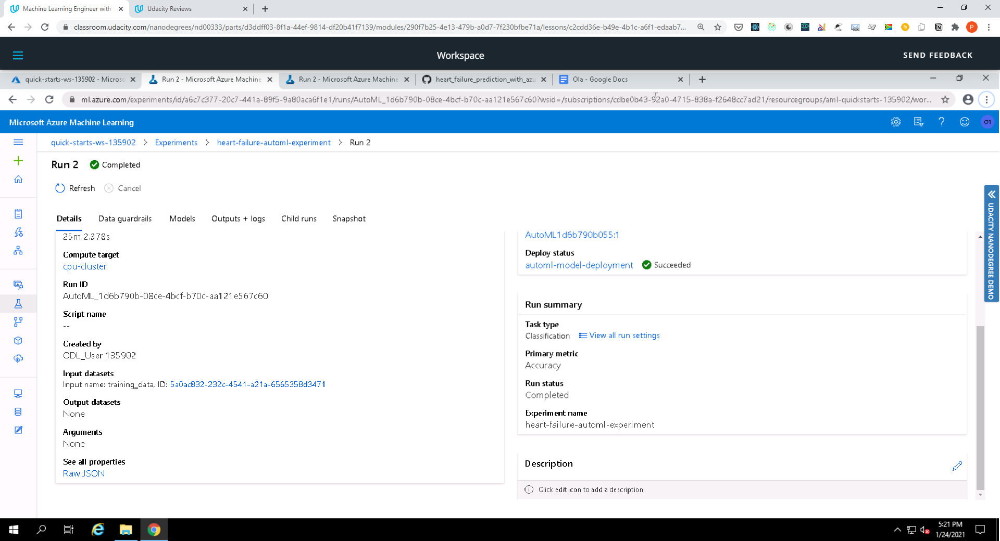

Automl models
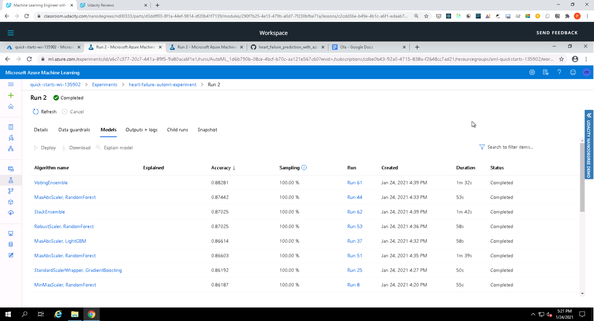

Completed run in Notebook
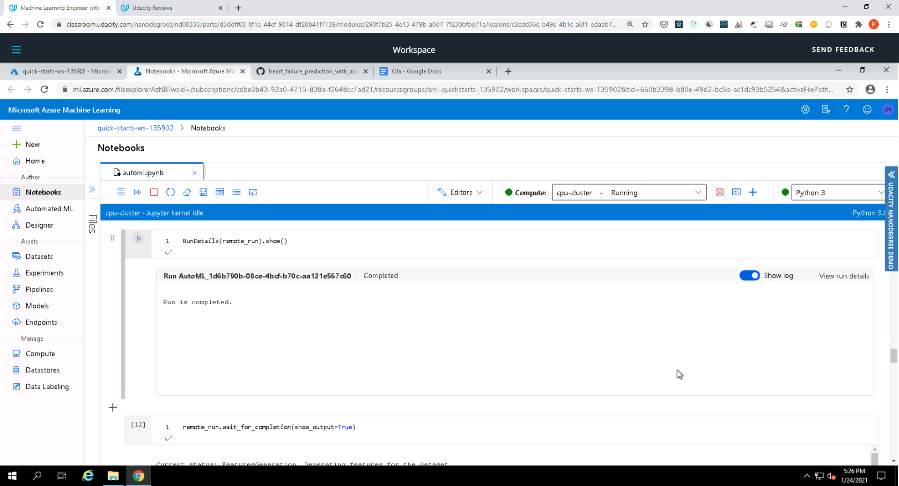
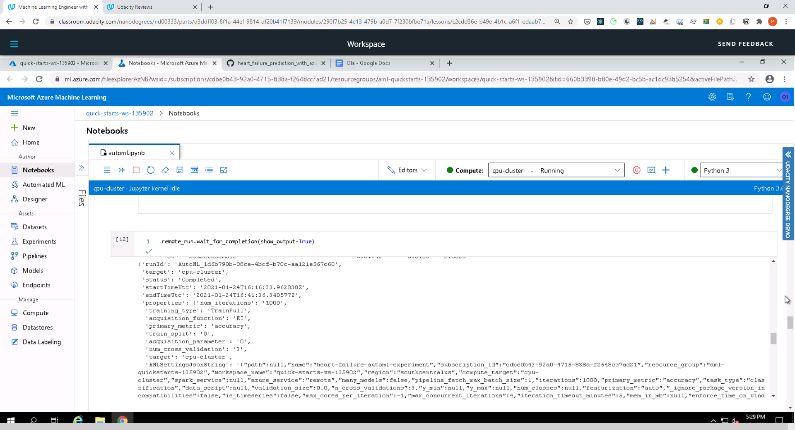

Best run
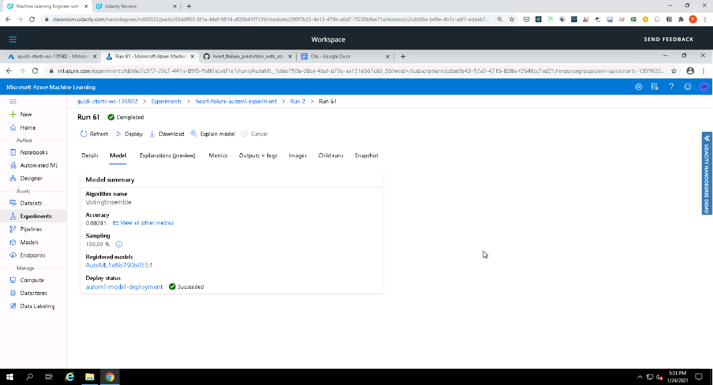

Best run metrics
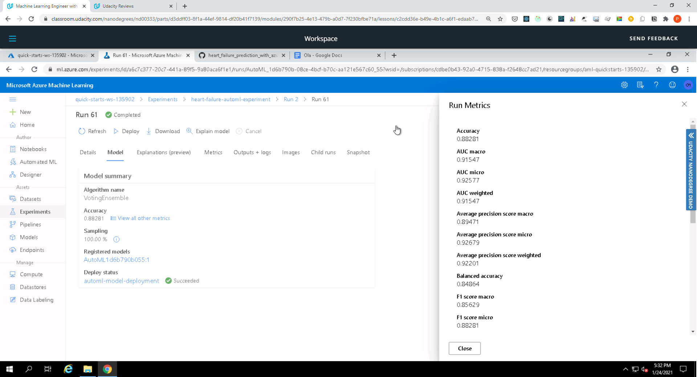
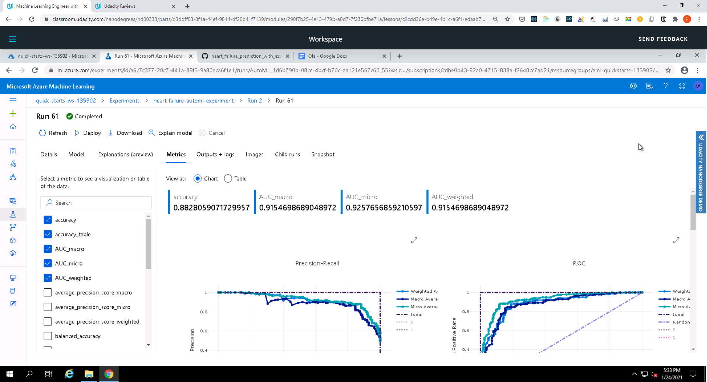

Best run in Notebook
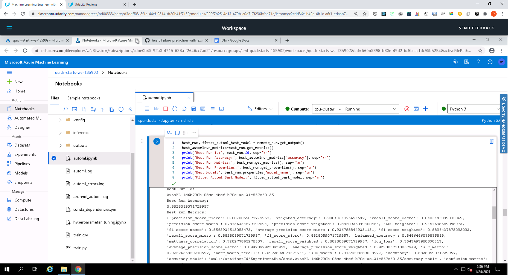

Best run metrics in Notebook
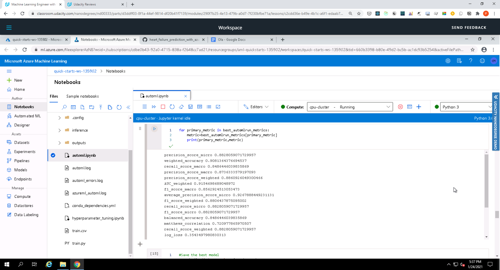

## Hyperparameter Tuning

The pipeline architecture is as follows:

* Data loaded from TabularDatasetFactory
* Dataset is further cleaned using a function called clean_data
* One Hot Encoding has been used for the categorical columns
* Dataset has been splitted into train and test sets
* Built a Logistic Regression model
* Hyperparameters has been tuned using Hyperdrive
* Selected the best model
* Saved the model 

**Benefits of the parameter sampler chosen**
The project used Random Sampling as it supports early termination of low-performance runs. In random sampling, hyperparameter values are randomly selected from the defined search space with two hyperparameters '--C' (Reqularization Strength) and '--max_iter' (Maximum iterations to converge).
Random sampling search is also faster, allows more coverage of the search space and parameter values are chosen from a set of discrete values or a distribution over a continuous range.

**The benefits of the early stopping policy chosen**
The Bandit policy was chosen because it stops a run if the target performance metric underperforms the best run so far by a specified margin. It ensures that we don't keep running the experiment running for too long and end up wasting resources and time looking for the optimal parameter. It is based on slack criteria and a frequency and delay interval for evaluation. Any run that doesn't fall within the slack factor or slack amount of the evaluation metric with respect to the best performing run will be terminated.

```
early_termination_policy = BanditPolicy(slack_factor = 0.1, evaluation_interval = 1, delay_evaluation=5)

ps = RandomParameterSampling(
    {
        "--C" :        choice(0.001,0.01,0.1, 0.5, 1,1.5,10,20,50,100,200,500,1000),
        "--max_iter" : choice(25,50,75,100,200,300)
    }
)

src = ScriptRunConfig(source_directory='.',
                      script='train.py',
                      compute_target=compute_target,
                      environment=sklearn_env)

hyperdrive_run_config =  HyperDriveConfig(
    hyperparameter_sampling = ps, 
    policy = early_termination_policy,
    primary_metric_name = 'Accuracy',
    primary_metric_goal = PrimaryMetricGoal.MAXIMIZE, 
    max_total_runs = 100,
    max_concurrent_runs = 4,
    run_config = src
)
```

### Results
The HyperDrive model resulted in an accuracy of 0.8333 which was slightly lower than the AutoML accuracy.

Compared to HyperDrive, AutoML architecture is quite superior, which enables to training 'n' number of models efficiently.

The reason in accuracies might be due to the fact that that we used less number of iterations in AutoML run, which might give better results with more iterations. AutoML also provides a wide variety of models and preprocessing steps which are not carried out Hyperdrive. However, the difference was quite small.

Completed run
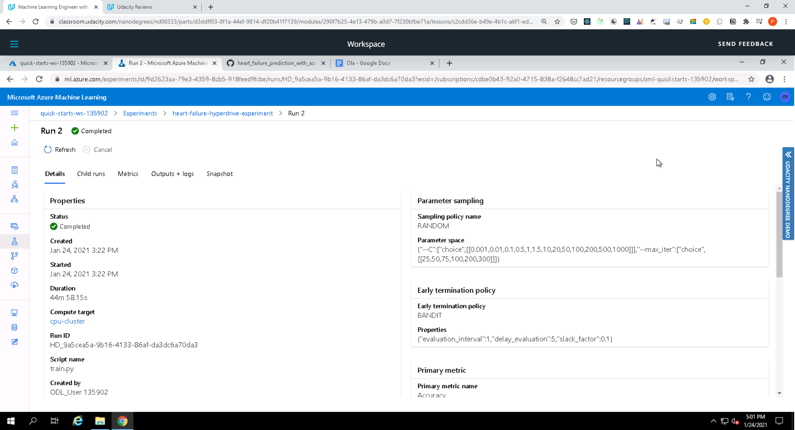

Run details
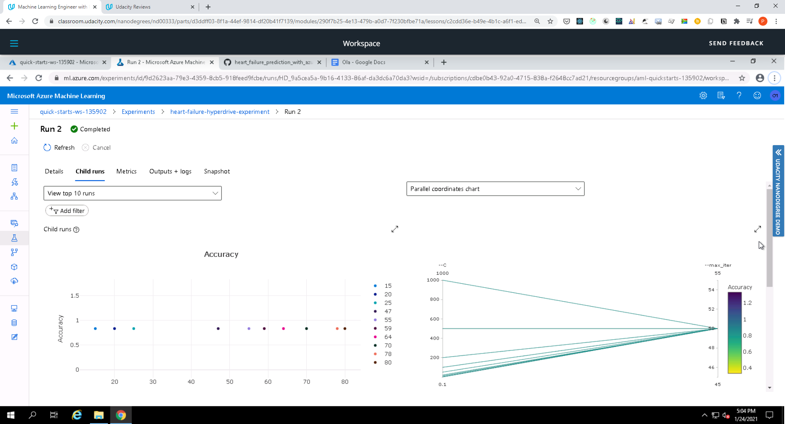
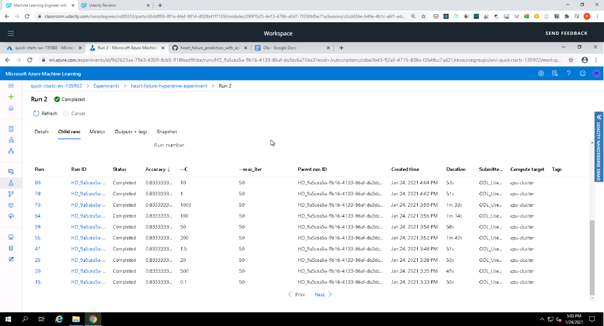

Run details in notebook
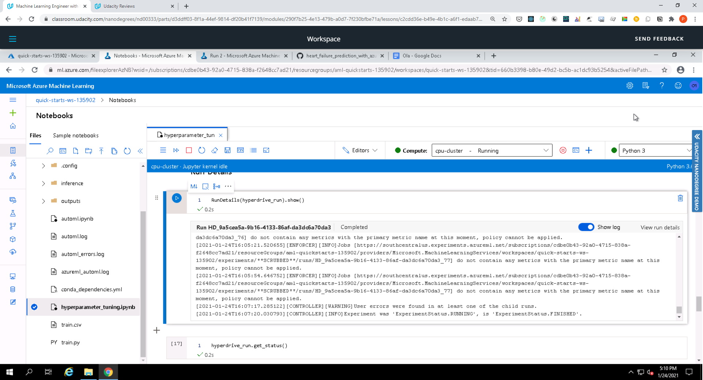

Best model and metrics
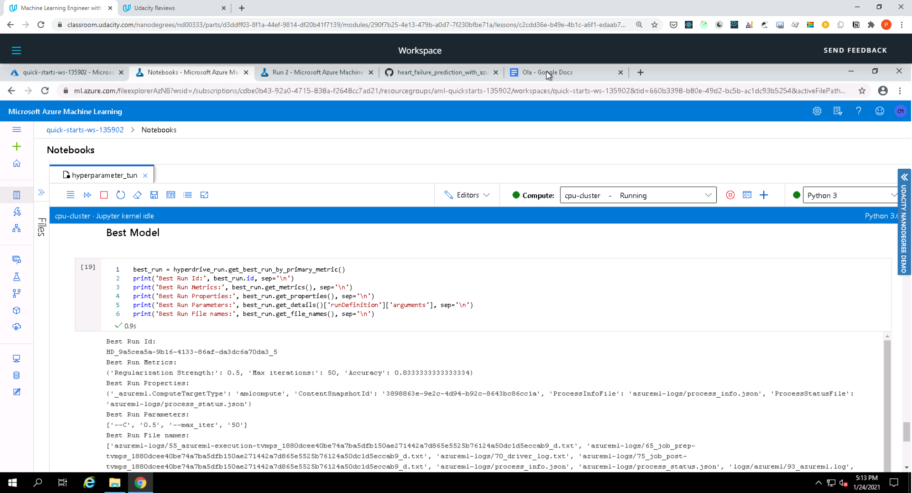

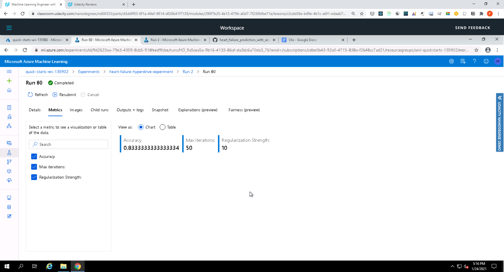

## Model Deployment
After comparing the above two models, the best model was the AutoML experiment with a higher accuracy of **0.88281**.

The AutoML model was then deployed as follows:

1. Get the best model from the training run
    ```
    model_name = best_run.properties['model_name']
    script_file_name = 'inference/score.py'
    best_run.download_file('outputs/scoring_file_v_1_0_0.py', 'inference/score.py')
    ```
2. Register the model
    ```
    description = 'Heart Failure Prediction AutoML Model'
    tags = None
    model = remote_run.register_model(model_name = model_name, description = description, tags = tags)
    print(model.name, model.id, model.version, sep='\t')
    ```
3. Download the score python file from azure ml
4. Create an inference configuration
5. Create an ACI deployment configuration
6. Deploy the model
7. Enable Application Insights
    ```
    from azureml.core.model import InferenceConfig
    from azureml.core.webservice import AciWebservice
    from azureml.core.webservice import Webservice
    from azureml.core.model import Model
    from azureml.core.environment import Environment

    inference_config = InferenceConfig(entry_script='inference/score.py')

    deployment_config = AciWebservice.deploy_configuration(cpu_cores = 1, 
                                                   memory_gb = 1, 
                                                   tags = {'type': "automl_classification"}, 
                                                   description = 'Heart Failure Prediction AutoML Service')

    deploy_service_name = 'automl-model-deployment'
    service = Model.deploy(ws, deploy_service_name, [model], inference_config, deployment_config)

    service.wait_for_deployment(show_output = True)

    # Enable Application Insights
    service.update(enable_app_insights=True)

    print('Service State:', service.state, sep='\n')
    print('Service Scoring URI:', service.scoring_uri, sep='\n')
    print('Service Swagger URI:', service.swagger_uri, sep='\n')
    ```    

To consume the model
1. We copy the rest endpoint
2. Create a sample JSON payload and post the payload to the endpoint using a HTTP Post 
    ```    
    import requests
    import json

    scoring_uri = service.scoring_uri

    data = {"data":
            [
              { 
                "age": 80,
                "anaemia": 1,
                "creatinine_phosphokinase": 146,
                "diabetes": 1,
                "ejection_fraction": 20,
                "high_blood_pressure": 0,
                "platelets": 127000,
                "serum_creatinine": 9.4,
                "serum_sodium": 137,
                "sex": 1,
                "smoking": 1,
                "time": 104
              },
              {
                "age": 42,
                "anaemia": 1,
                "creatinine_phosphokinase": 111,
                "diabetes": 0,
                "ejection_fraction": 38,
                "high_blood_pressure": 1,
                "platelets": 87000,
                "serum_creatinine": 0.8,
                "serum_sodium": 116,
                "sex":0,
                "smoking": 0,
                "time": 13
              },
          ]
        }

    input_data = json.dumps(data)
    headers = {'Content-Type': 'application/json'}
    resp = requests.post(scoring_uri, input_data, headers=headers)
    print(resp.json())
    ```    

3. Running endpoint 

    ```    
    Running.........................................
    Succeeded
    ACI service creation operation finished, operation "Succeeded"
    Service State:
    Healthy
    Service Scoring URI:
    http://357c9640-97d9-4585-a0be-dd03c068da9f.southcentralus.azurecontainer.io/score
    Service Swagger URI:
    http://357c9640-97d9-4585-a0be-dd03c068da9f.southcentralus.azurecontainer.io/swagger.json

    ```    

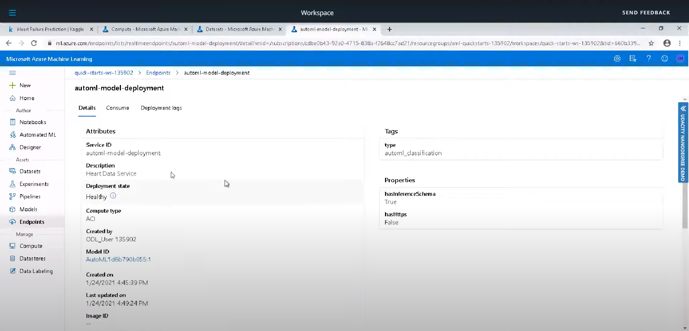
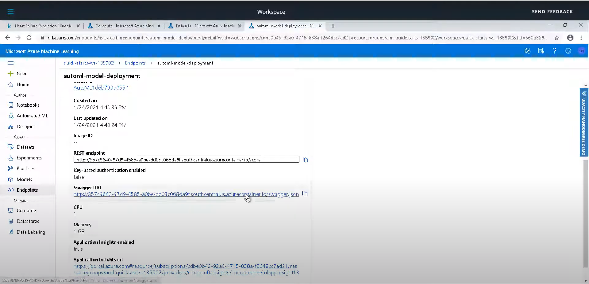


## Screen Recording
[Screencast on YouTube](https://youtu.be/B8iwyPZ3j3k)

## Built With

* [Azure](https://portal.azure.com/) - Cloud service provider used
* [Python](https://www.python.org/) - The programming language used
* [Heart Failure Prediction dataset](https://archive.ics.uci.edu/ml/machine-learning-databases/00519/heart_failure_clinical_records_dataset.csv) - Dataset used

## Authors

* **[Pemberai Sweto](https://github.com/thepembeweb)** - *Initial work* - [Heart Failure Prediction with Azure ML
](https://github.com/thepembeweb/heart_failure_prediction_with_azure_ml)

## License

[](http://badges.mit-license.org)

- This project is licensed under the MIT License - see the [LICENSE](LICENSE.md) file for details
- Copyright 2021 © [Pemberai Sweto](https://github.com/thepembeweb).
