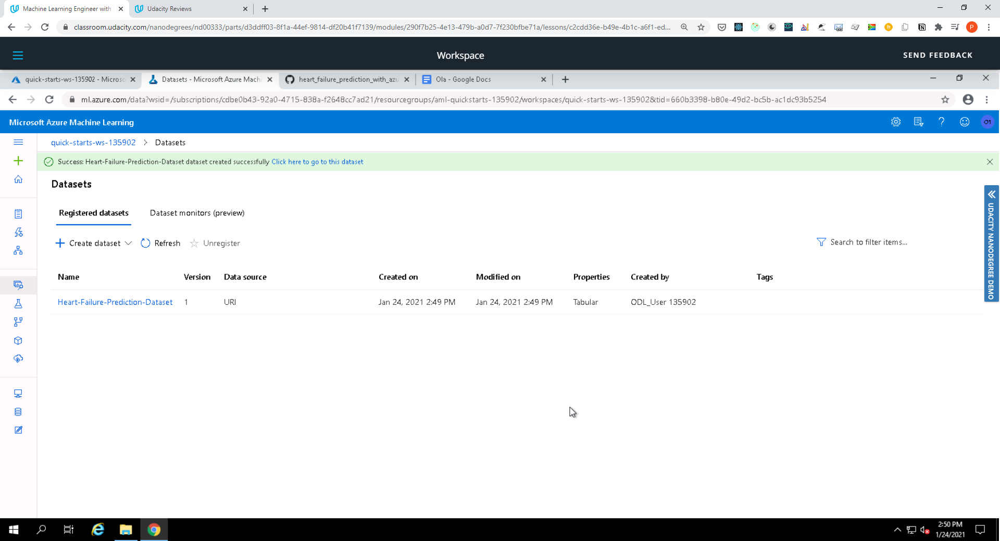

# Heart Failure Prediction with Azure ML

This project demonstrates how to use an external dataset in a Microsoft Azure Machine Learning workspace; train a model using the different tools available in the AzureML framework as well deploy the model as a web service.

## Dataset

### Overview
To make predictions about heart failure, we used the open source [Heart Failure Prediction](https://www.kaggle.com/andrewmvd/heart-failure-clinical-data/) dataset from kaggle  to build a classification model. This dataset uses 12 clinical features for predicting death events by heart failure.

### Task
Our goal is to find the best classification model for predicting death events by heart failure. We will build the models using hyperdrive and automl API from azureml. Given the 12 clinical features in the dataset our model will use DEATH_EVENT as the target column (binary: “1”, means “Yes”, “0” means “No”)

### Access
The dataset was registered into the workspace via URI of the public Heart Failure Prediction csv file.


## Automated ML
The AutoML experiment used the following key settings, mostly to limit the compute time and cost.

* Time limit for experimentation is 30 minutes
* Iteration should time out in 5 minutes
* Max cores per iteration set to -1
* Max concurrent iterations set to 4
* Early stopping has been enabled
* pThe primary metric has been set for accuracy
* Uses 3 fold cross validation
* Limit the number of concurrent iteration to 4
* Featurization enabled to allow AutoML to evaludate different feature engineering of the numerical features

```
automl_settings = {
    "experiment_timeout_minutes" : 30,
    "iteration_timeout_minutes": 5,
    "max_cores_per_iteration": -1,
    "max_concurrent_iterations": 4,
    "enable_early_stopping" : True,
    "primary_metric": 'accuracy',
    "n_cross_validations": 3,
    "featurization": 'auto',
    "verbosity": logging.INFO,
}

automl_config = AutoMLConfig(
    task="classification",
    compute_target=compute_target,
    training_data= train,
    label_column_name="DEATH_EVENT",
    debug_log = 'automl_errors.log',
    **automl_settings)
```

### Results
The best model from Auto ML is a VotingEnsemble with an AUC Weighted score of **0.9950**.

Completed run


Automl models


Completed run in Notebook


Best run


Best run metrics


Best run in Notebook


Best run metrics in Notebook


## Hyperparameter Tuning
*TODO*: What kind of model did you choose for this experiment and why? Give an overview of the types of parameters and their ranges used for the hyperparameter search


### Results
*TODO*: What are the results you got with your model? What were the parameters of the model? How could you have improved it?

*TODO* Remeber to provide screenshots of the `RunDetails` widget as well as a screenshot of the best model trained with it's parameters.

## Model Deployment
*TODO*: Give an overview of the deployed model and instructions on how to query the endpoint with a sample input.

## Screen Recording
[Screencast on YouTube](https://youtu.be/B8iwyPZ3j3k)

## Built With

* [Azure](https://portal.azure.com/) - Cloud service provider used
* [Python](https://www.python.org/) - The programming language used
* [Heart Failure Prediction dataset](https://archive.ics.uci.edu/ml/machine-learning-databases/00519/heart_failure_clinical_records_dataset.csv) - Dataset used

## Authors

* **[Pemberai Sweto](https://github.com/thepembeweb)** - *Initial work* - [Operationalizing Machine Learning pipeline in Azure
](https://github.com/thepembeweb/operationalizing_machine_learning_in_azure)

## License

[](http://badges.mit-license.org)

- This project is licensed under the MIT License - see the [LICENSE](LICENSE.md) file for details
- Copyright 2021 © [Pemberai Sweto](https://github.com/thepembeweb).
