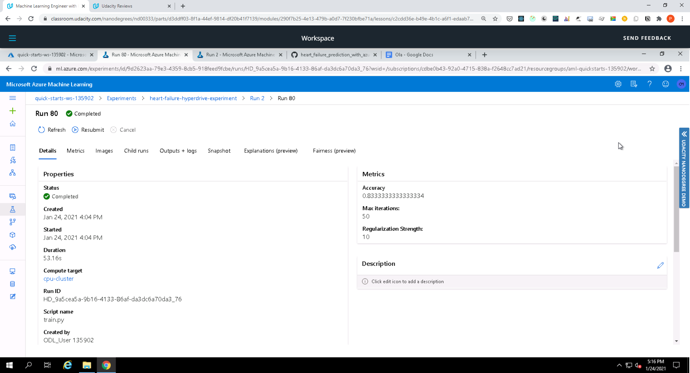

# Heart Failure Prediction with Azure ML

This project demonstrates how to use an external dataset in a Microsoft Azure Machine Learning workspace; train a model using the different tools available in the AzureML framework as well deploy the model as a web service.

## Dataset

### Overview
To make predictions about heart failure, we used the open source [Heart Failure Prediction](https://www.kaggle.com/andrewmvd/heart-failure-clinical-data/) dataset from kaggle  to build a classification model. This dataset uses 12 clinical features for predicting death events by heart failure.

### Task
Our goal is to find the best classification model for predicting death events by heart failure. We will build the models using hyperdrive and automl API from azureml. Given the 12 clinical features in the dataset our model will use DEATH_EVENT as the target column (binary: “1”, means “Yes”, “0” means “No”)

### Access
The dataset was registered into the workspace via URI of the public Heart Failure Prediction csv file.


## Automated ML
The AutoML experiment used the following key settings, mostly to limit the compute time and cost.

* Time limit for experimentation is 30 minutes
* Iteration should time out in 5 minutes
* Max cores per iteration set to -1
* Max concurrent iterations set to 4
* Early stopping has been enabled
* pThe primary metric has been set for accuracy
* Uses 3 fold cross validation
* Limit the number of concurrent iteration to 4
* Featurization enabled to allow AutoML to evaludate different feature engineering of the numerical features

```
automl_settings = {
    "experiment_timeout_minutes" : 30,
    "iteration_timeout_minutes": 5,
    "max_cores_per_iteration": -1,
    "max_concurrent_iterations": 4,
    "enable_early_stopping" : True,
    "primary_metric": 'accuracy',
    "n_cross_validations": 3,
    "featurization": 'auto',
    "verbosity": logging.INFO,
}

automl_config = AutoMLConfig(
    task="classification",
    compute_target=compute_target,
    training_data= train,
    label_column_name="DEATH_EVENT",
    debug_log = 'automl_errors.log',
    **automl_settings)
```

### Results
The best model from Auto ML is a VotingEnsemble with an AUC Weighted score of **0.88281**.

Completed run


Automl models


Completed run in Notebook


Best run


Best run metrics


Best run in Notebook


Best run metrics in Notebook


## Hyperparameter Tuning

The pipeline architecture is as follows:

* Data loaded from TabularDatasetFactory
* Dataset is further cleaned using a function called clean_data
* One Hot Encoding has been used for the categorical columns
* Dataset has been splitted into train and test sets
* Built a Logistic Regression model
* Hyperparameters has been tuned using Hyperdrive
* Selected the best model
* Saved the model 

**Benefits of the parameter sampler chosen**
The project used Random Sampling as it supports early termination of low-performance runs. In random sampling, hyperparameter values are randomly selected from the defined search space with two hyperparameters '--C' (Reqularization Strength) and '--max_iter' (Maximum iterations to converge).
Random sampling search is also faster, allows more coverage of the search space and parameter values are chosen from a set of discrete values or a distribution over a continuous range.

**The benefits of the early stopping policy chosen**
The Bandit policy was chosen because it stops a run if the target performance metric underperforms the best run so far by a specified margin. It ensures that we don't keep running the experiment running for too long and end up wasting resources and time looking for the optimal parameter. It is based on slack criteria and a frequency and delay interval for evaluation. Any run that doesn't fall within the slack factor or slack amount of the evaluation metric with respect to the best performing run will be terminated.

```
early_termination_policy = BanditPolicy(slack_factor = 0.1, evaluation_interval = 1, delay_evaluation=5)

ps = RandomParameterSampling(
    {
        "--C" :        choice(0.001,0.01,0.1, 0.5, 1,1.5,10,20,50,100,200,500,1000),
        "--max_iter" : choice(25,50,75,100,200,300)
    }
)

src = ScriptRunConfig(source_directory='.',
                      script='train.py',
                      compute_target=compute_target,
                      environment=sklearn_env)

hyperdrive_run_config =  HyperDriveConfig(
    hyperparameter_sampling = ps, 
    policy = early_termination_policy,
    primary_metric_name = 'Accuracy',
    primary_metric_goal = PrimaryMetricGoal.MAXIMIZE, 
    max_total_runs = 100,
    max_concurrent_runs = 4,
    run_config = src
)
```

### Results
The HyperDrive model resulted in an accuracy of 0.8333 which was slightly lower than the AutoML accuracy.

Compared to HyperDrive, AutoML architecture is quite superior, which enables to training 'n' number of models efficiently.

The reason in accuracies might be due to the fact that that we used less number of iterations in AutoML run, which might give better results with more iterations. AutoML also provides a wide variety of models and preprocessing steps which are not carried out Hyperdrive. However, the difference was quite small.

Completed run


Run details


Run details in notebook


Best model and metrics




## Model Deployment
*TODO*: Give an overview of the deployed model and instructions on how to query the endpoint with a sample input.

## Screen Recording
[Screencast on YouTube](https://youtu.be/B8iwyPZ3j3k)

## Built With

* [Azure](https://portal.azure.com/) - Cloud service provider used
* [Python](https://www.python.org/) - The programming language used
* [Heart Failure Prediction dataset](https://archive.ics.uci.edu/ml/machine-learning-databases/00519/heart_failure_clinical_records_dataset.csv) - Dataset used

## Authors

* **[Pemberai Sweto](https://github.com/thepembeweb)** - *Initial work* - [Operationalizing Machine Learning pipeline in Azure
](https://github.com/thepembeweb/operationalizing_machine_learning_in_azure)

## License

[](http://badges.mit-license.org)

- This project is licensed under the MIT License - see the [LICENSE](LICENSE.md) file for details
- Copyright 2021 © [Pemberai Sweto](https://github.com/thepembeweb).
